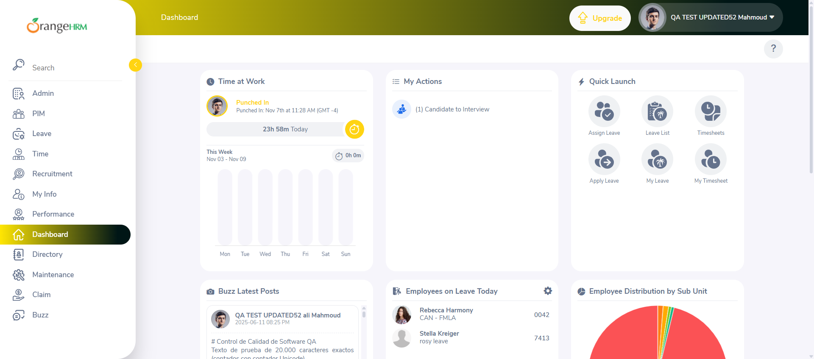
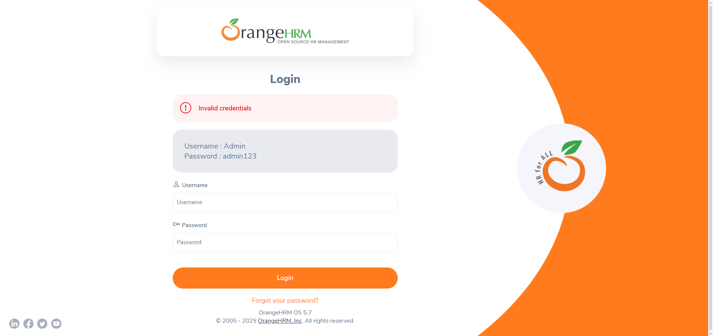
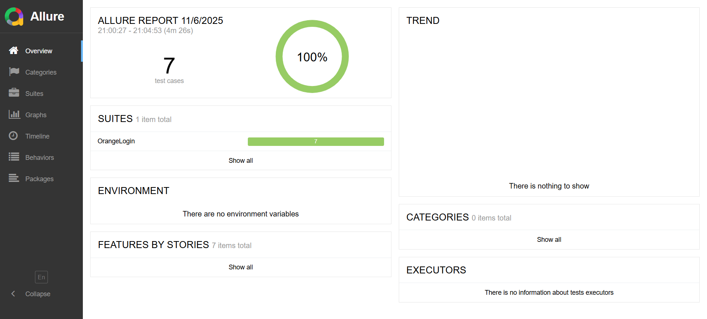
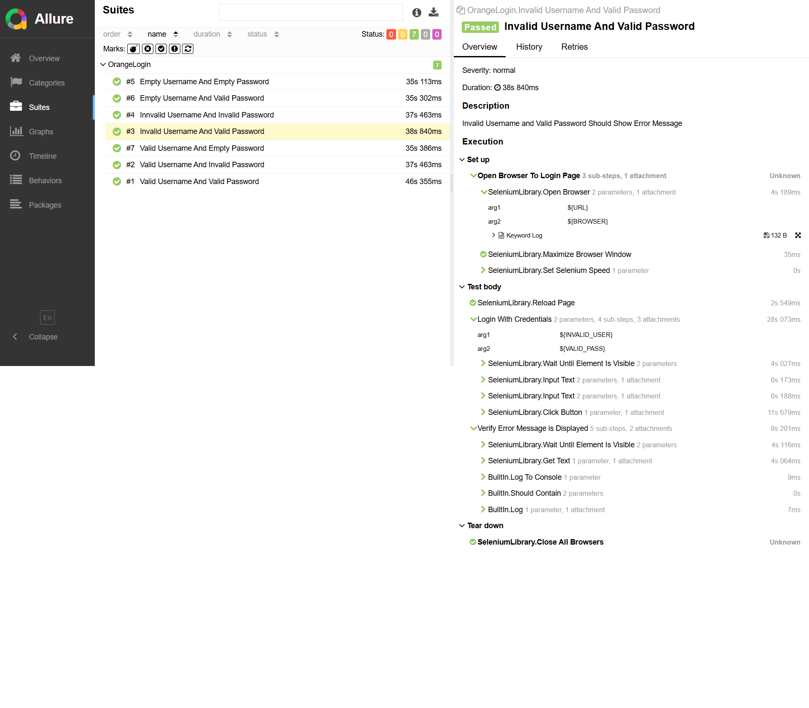
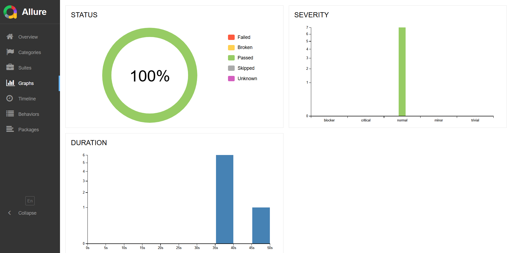
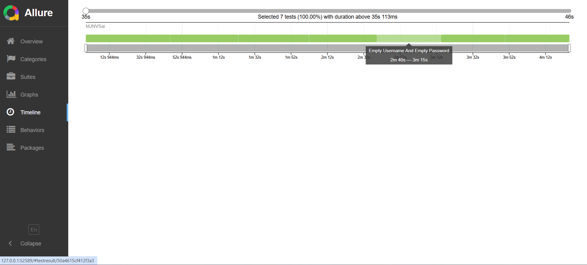

# 🤖 OrangeHRM Login Automation Testing Using Robot Framework  

 


---

## 📝 Project Description  

1. This project automates the **OrangeHRM Login functionality** using **Robot Framework** and **Selenium WebDriver** in Python.  
2. It performs multiple **positive and negative login test cases** — including valid, invalid, and empty credentials — and generates **Allure Reports** for detailed execution results.  
3. The setup follows a structured **virtual environment** approach and leverages **data-driven testing** for reusability 🔐✨  .

---

## 📁 Project Directory Structure  

```

robotlearn1/
│
├── OrangeHRM_Login/
│   ├── allure-reports/
│   ├── allure-results/
│   ├── log.html
│   ├── Login_Sucess_Dashboard_Pic.png
│   ├── OrangeLogin.robot
│   ├── output.xml
│   ├── report.html
│   ├── selenium-screenshot-1.png
│
├── Scripts/
│   ├── activate.bat
│   ├── deactivate.bat
│
└── pyvenv.cfg

````

---

## ⚙️ Installation & Environment Setup  

### 🧱 Step 1: Create Python Virtual Environment  
```bash
python -m venv robotlearn1
````

✅ Creates a **virtual environment** named `robotlearn1` to isolate project dependencies.

### 🚀 Step 2: Activate Virtual Environment

```bash
robotLearn1\Scripts\activate
```

✅ Activates your environment to ensure all Python libraries install locally.

### 📦 Step 3: Install Required Packages

```bash
pip install robotframework
pip install selenium
pip install robotframework-seleniumlibrary
pip install webdriver-manager
pip install robotframework-datadriver
pip install -U robotframework-datadriver[XLS]
```

✅ Installs Robot Framework, Selenium support, WebDriver manager, and Excel-based DataDriver for data-driven testing.

### 🧩 Step 4: Install VS Code Extension

> **Extension:** `Robot Framework Language Server`
> ✅ Enables syntax highlighting, code suggestions, and easy Robot execution in VS Code.

---

## 🧪 Test Execution Command

```bash
robot ./OrangeLogin.robot
```

✅ Runs the `OrangeLogin.robot` test suite — executes all test cases and generates the default **log.html**, **report.html**, and **output.xml** files inside the project directory.

---

## 🧾 Allure Report Setup & Commands

### 1️⃣ Download Allure

📦 Download from:
👉 [Allure 2.35.1 Release Page](https://github.com/allure-framework/allure2/releases/download/2.35.1/allure-2.35.1.zip)

Extract and copy the **bin folder path**.

Add The Copied Path to the **Environment Variables**.

---

### 2️⃣ Add Allure to PATH

Inside your virtual environment’s `Scripts/activate.bat`, add this line (adjust to your path):

```bat
set "PATH=%PATH%;D:\VenkatSai\Python_RobotFramework_Learn\Allure_Report_Install\allure-2.35.1\bin"
```

✅ This ensures `allure` command works globally when your venv is active.

---

### 3️⃣ Verify Allure Installation

```bash
allure --version
```

✅ Confirms Allure CLI is working.

---

### 4️⃣ Run Robot Tests with Allure Listener

```bash
robot --listener allure_robotframework;./allure-results OrangeLogin.robot
```

✅ Executes the test suite and stores raw test data in the **`allure-results`** directory.

---

### 5️⃣ Generate Allure Report

```bash
allure generate ./allure-results -o ./allure-report --clean
```

✅ Converts Allure results into a beautiful Interactive **HTML report** and saves it in **`allure-report`**.

---

### 6️⃣ Open Allure Report in Browser

```bash
allure open ./allure-report
```

✅ Launches the generated **Allure Dashboard** in your default browser 🌐

> ⚠️ **Note:** Allure reports work only on a web server (not directly via file path).

---

## ✅ Test Scenarios Covered

| Test Case                           | Username | Password | Expected Result                      |
| ----------------------------------- | -------- | -------- | ------------------------------------ |
| Valid Username & Valid Password     | ✅        | ✅        | Login Successful & Dashboard Visible |
| Valid Username & Invalid Password   | ✅        | ❌        | Error: Invalid Credentials           |
| Invalid Username & Valid Password   | ❌        | ✅        | Error: Invalid Credentials           |
| Invalid Username & Invalid Password | ❌        | ❌        | Error: Invalid Credentials           |
| Empty Username & Empty Password     | ❌        | ❌        | Field Required Message               |
| Empty Username & Valid Password     | ❌        | ✅        | Field Required Message               |
| Valid Username & Empty Password     | ✅        | ❌        | Field Required Message               |

---

## 🖼️ Screenshots

### ✅ Successful Login



### ❌ Invalid Credentials



### 📊 Allure Dashboard - 1



### 📈 Allure Dashboard - 2



### 📊 Allure Dashboard - 3



### 📈 Allure Dashboard - 4



---

## 💡 Key Features

* 🚀 **Robot Framework + Selenium** Integration
* 🔐 **End-to-End Login Validation**
* 📊 **Allure Report Visualization**
* 🧠 **Keyword-Driven & Data-Driven Testing**
* 💻 **Reusable Modular Test Design**

---

<!-- ## 👨‍💻 Author

**👤 Venkat Sai**
📧 *Python | Robot Framework | Selenium | Automation Enthusiast*
🌐 [GitHub Profile](https://github.com/MJNVSai)

--- -->

## 🏁 Final Note
> This project was built to **Learn And Demonstrate 🤖 Robot Framework Automation** with Selenium and Allure integration.

> It highlights how test cases can be modular, maintainable, and visually represented using Allure reports 💻✨.

---

